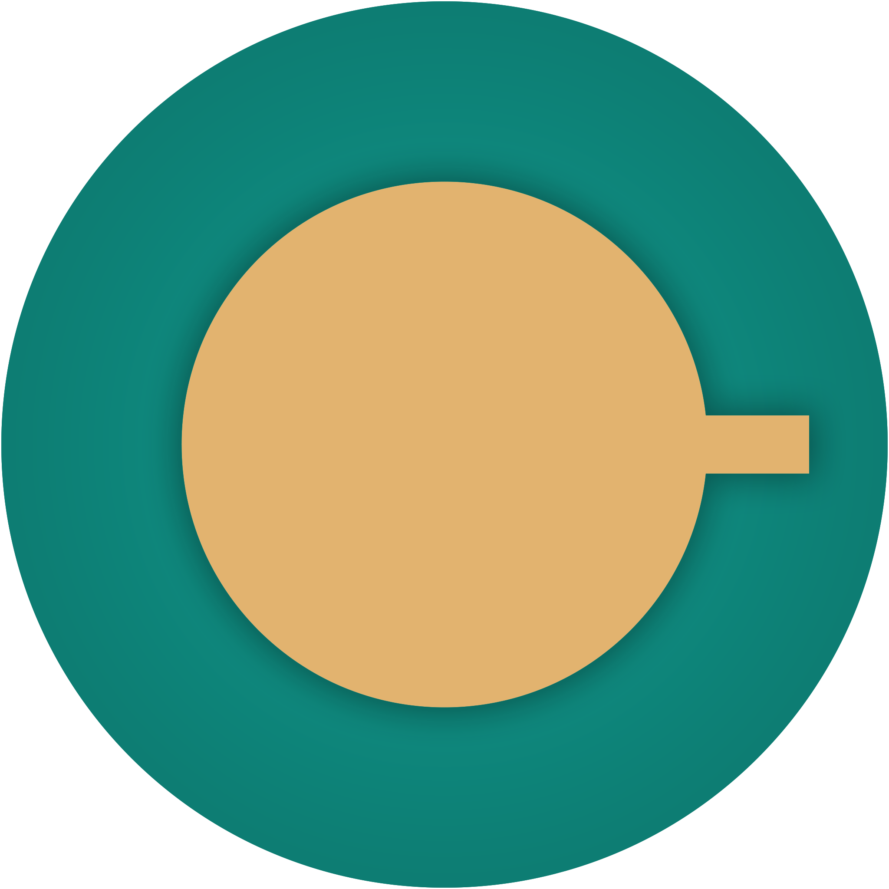
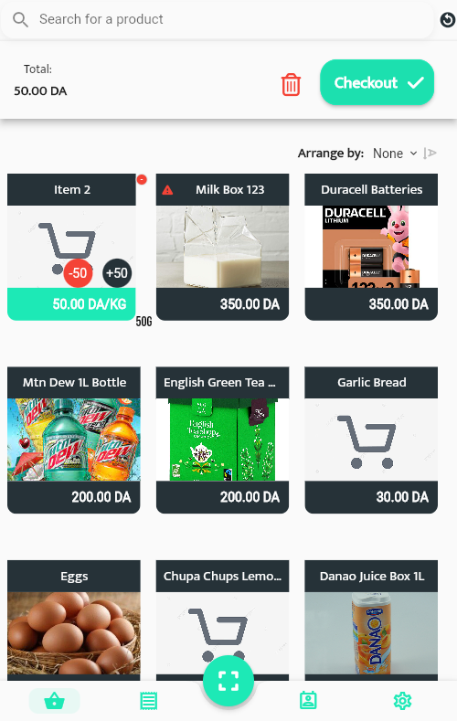
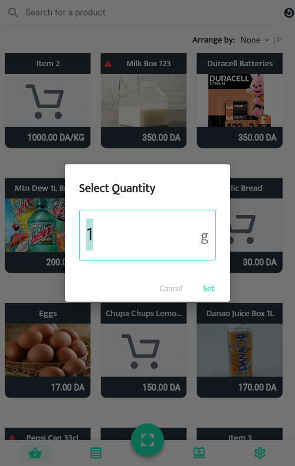
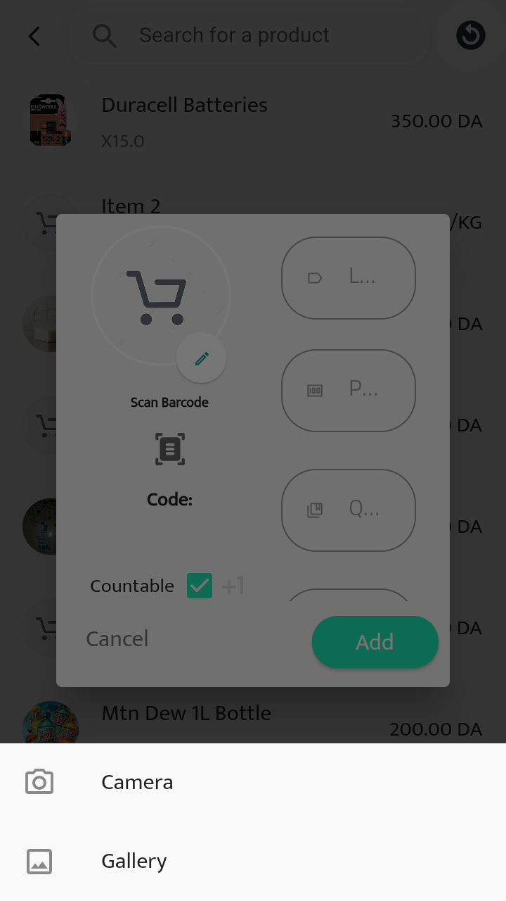
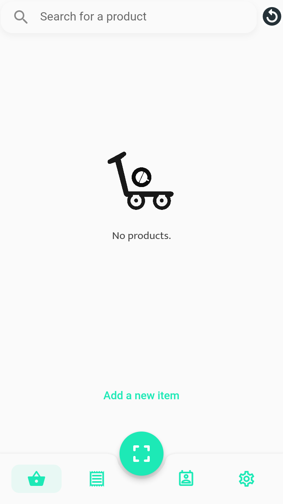
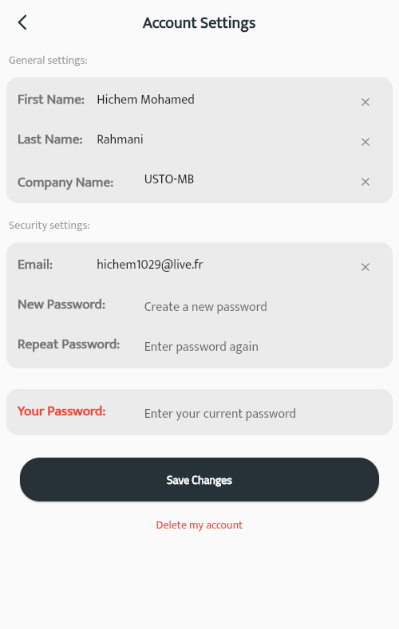
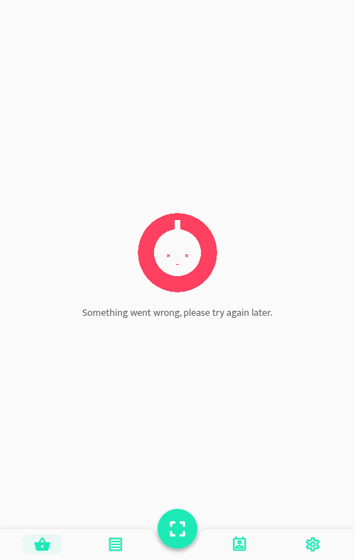
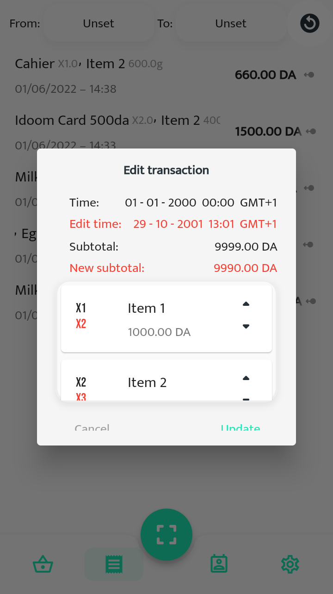

# **CIPS Mobile**

CIPS Mobile is a cross-platform point-of-sale application as the abbreviation indicates (<u>C</u>ross-platform <u>I</u>ntegrated <u>P</u>oint of sale <u>S</u>ystem) which aims to help convenience stores and food stores manage their stock with a reduced budget and space saving, to develop my application I decided to use Fluter with Google's Firebase.

   

### <i>1. CIPS Mobile Logo</i>

   

## **Used:**

 

 

 

## Some screenshots:

